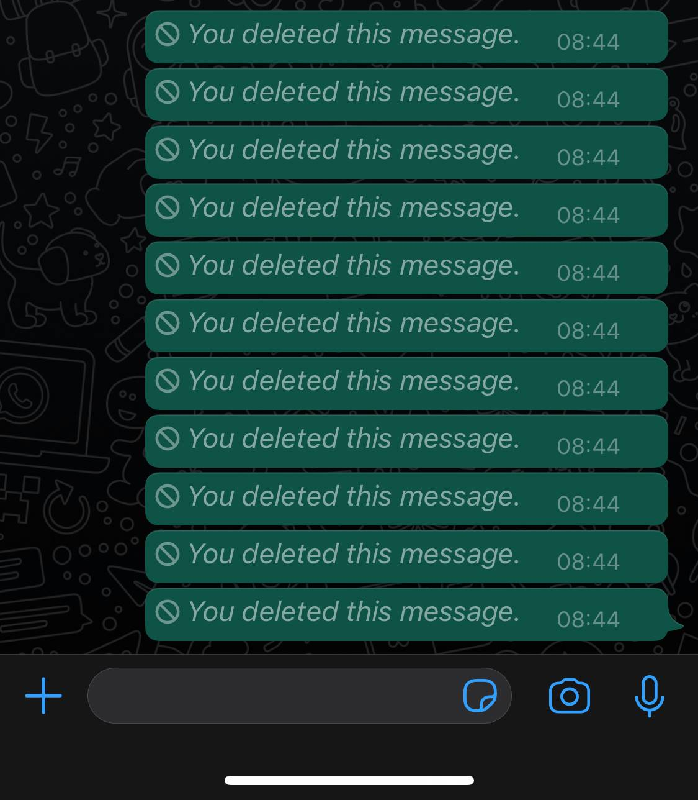

WhatsApp is probably one of my favorite applications, and frequently, my first point of contact to reach out to family friends. Perhaps it's quite surprising to see an app up here that 1 billion people use every day for its clean and straightforward user interface. You're probably thinking...what could he possibly have to complain about with WhatsApp?

Let me paint a picture. You just sent a message to someone and autocorrect decided to play the popular children's game Telephone poorly. Or better yet, you got a bit frustrated and just sent a message that you probably shouldn't have. If we're honest, it's happened to most of us.

Not to worry, because WhatsApp's brilliant "Delete for Everyone" feature is here to save the day. Well, kind of. Telling the recipient that you deleted a message that you just sent utterly defeats the purpose of letting users delete it. It looks suspicious, it's just awkward, and it achieves nothing. What generally follows is an awkward silence, or, better yet, my favorite: "what did you just delete?"

It's not what the user expects, and it also isn't deleting. A quick Google search will tell you that, in this context, "delete" refers to a typical command on a computer that erases text or information. Now imagine the frustration when after a frantic, rushed, or silly mistake, you want to save yourself. WhatsApp gives you a glimmer of hope, but not a sliver more because shortly after clicking delete, you realize what you've just done. You haven't saved yourself, you've just opened yourself up to awkwardness and questions you probably don't want to deal with.

This is an excellent example of poor User Experience (UX) design because WhatsApp's "Delete for Everyone" feature doesn't deliver on what it promises. Instead of removing the message, it censors it by prohibiting the recipient from reading the message, while still letting them know it's there. It almost feels more like a "sanitized" redacted government document that contains classified information than a helpful cross-platform messaging service.

The most frustrating part of it all is that these User Experience issues would not be difficult to fix. In an ideal universe, the feature would do what it says and just delete the message. You could also offer a period of forgiveness, after which the message was sent, maybe a minute, where the original sender can remove the message. The message could then either become set in stone in the chat or be redacted the same way it already is. And if for some reason, WhatsApp is so insistent about keeping the same functionality, the least they could do is change the name so that it actually meets user's expectations with its function - could be "redact," "censor" or even just a plain-old "block."

This is something we've all experienced. It's a massive design flaw in an otherwise exceptionally designed application that holds it's enormous user-base because of its simplicity and ability to deliver on its promises. Tell us, WhatsApp, why can't you do it here? WhatsApp with that?
