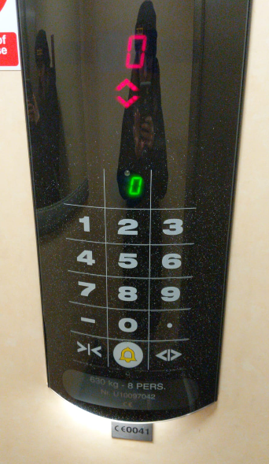
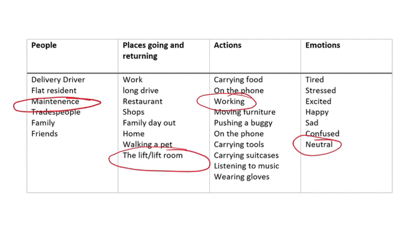

I moved into a block of flats last year, and until very recently, the lift (elevator if you're American) was broken. The building is 4 floors and a basement, -1, 0, 1, 2, 3. So you can imagine my reaction and the many questions I had when I used the lift for the first time.

	

    "How do I use this?" 
      "Why a 0-9 keypad? There are only 5 different floors."
      "Why capacitive buttons? – will it work when I have cold hands or gloves?"
      "Why '.'?"
      "What happens if you press 9?"
      "Is there a hidden Batman cave under my building on -6?"
      "Is this actually Willy Wonkers glass elevator?"
  
  

And on and on…

On a serious note though generally as best practice for physical products 'form ever follows function' - coined by the American architect, [Louis Sullivan](https://en.wikipedia.org/wiki/Louis_Sullivan#:~:text=Louis%20Henry%20Sullivan%20%28September%203%2C%201856%20%E2%80%93%20April,the%20%22father%20of%20skyscrapers%22%20and%20%22father%20of%20modernism%22.). Although there is an argument that this is not true for digital products, e.g. smartphones, because they have so many functions. In this case, I think I am safe to say it counts… Unless you are designing a [Memphis style](https://en.wikipedia.org/wiki/Memphis_Group) lift.

The building was built in 2004, and the lift is original. After a quick internet search, it turns out the lift is the [Schindler Smart002 MRL](https://elevation.fandom.com/wiki/SchindlerSmart_MRL) which was discontinued in mid-2000.

My internal UX voice is going 'great, so they are no longer in use, but how did Schindlers get to this design in the first place?'

Perhaps it was a way of reducing costs and customisation for each building? By providing a 0-9 number pad with '–'and '.' you have a one size fit's all buildings. Still not sure what the '.' is for though… But is it worth it at the cost of creating a solution that has a bad user experience?

Let's break this down into people who could use the lift, places they are returning from and going to, emotions and actions; 

To narrow this a little I am assuming the lift is the lift in my small block of flats.

In only one of these scenarios should you expect the lift user to want to think about how to use the lift, the maintenance person in the lift, working with a neutral emotion or maybe still confused?

I think that was what really got to me, I have never had to think about using a lift unless it's which floor do I need. Why fix what isn't broken? So what is it about this lift that makes the user experience worse than others? And why does this design seem like an afterthought?

<iframe src="https://giphy.com/embed/P8XjmO1TTX3Nu" width="400"  frameBorder="0" class="giphy-embed" allowFullScreen></iframe>
<a href="https://giphy.com/gifs/elf-elevator-P8XjmO1TTX3Nu">via GIPHY</a>

Audible, physical and visual feedback and affordances. 
The majority of lifts have mechanical buttons, including a variation of this lift design. When you see a mechanical button you know to press it, that's because of the affordances and signifiers considered in the design are doing their job. The button then moves and gives you visual, physical and audible ('ding') feedback that it has been pressed. 

When you see the numbers on the smart002 panel, you also know to press them. However, you get no physical or visual feedback as it's a capacitive button, not a 'touch screen'. There is a delay to the screen showing the floor number and to the audible feedback. This usually ends with me pressing the button too many times and cancelling out the request. As you can see in this video;

<iframe width="560" height="315" src="https://www.youtube.com/embed/jKJbQzeni08" frameborder="0" allow="accelerometer; autoplay; encrypted-media; gyroscope; picture-in-picture" allowfullscreen></iframe>

[Capacitive](https://en.wikipedia.org/wiki/Capacitive_sensing) buttons. (I'm not 100% sure which type of touch technology the lift uses, my assumption is it's a capacitive technology.)  As well as having no visual feedback in the smart002 design, there are other usability issues too, some of them I wouldn't have really considered until COVID-19. You have to use something that conducts electricity to use the button, usually a hand. Think of the potential spread. Actually here's an article – [Asymptomatic woman infects 71 people after using her apartment lift](https://metro.co.uk/2020/07/13/asymptomatic-woman-infects-71-people-using-apartment-lift-12983273/). Also when It's cold outside do you really want to take off your gloves?

Too many buttons for the number of floors. For anyone who is not familiar with the building, for any floor that does not exist the small 2 digit screen shows ‘Er'. This could miss lead you into thinking the lift is broken.

The smart002 lift design was discontinued in mid-2000, and replaced with [Schindler 3300](https://www.schindler.com/e-brochure/uk/3300/controls.html) in 2005. What did Schindler do to improve the UX of the lift? 

<iframe width="560" height="315" src="https://www.youtube.com/embed/Nxs-hblDwdI" frameborder="0" allow="accelerometer; autoplay; encrypted-media; gyroscope; picture-in-picture" allowfullscreen></iframe>

Just like a physical button if you think back to the days of Windows 98 or XP, we used [skeuomorphism](https://www.interaction-design.org/literature/topics/skeuomorphism) to indicate you should press a button and when that button was pressed. We graduated to flat UI design which is much more subtle but still gives you that visual feedback (affordances). The 3300 follows this pattern. When you press the capacitive button, it turns the floor number from blue to red and makes that familiar 'ding'. This gives you audible and visual feedback as long as you're not colour blind. So a step in the right direction but it's been 15 years, please fix this [accessibility issue](https://www.w3.org/WAI/WCAG21/quickref/?versions=2.0&currentsidebar=%23col_customize&tags=color)!

I forget that we have so many advantages as UX designers of app's and websites. Our agile process allows us to fix and continuously improve the experience we have when it's hardware; you only get one shot. 

To conclude the rant. Thou shalt always take a human-centred approach, even when it's a UI in a physical product. (Why do they always seem like an afterthought?) One size fit's all sounds great, but is it worth it? 

I'll leave you with this; the [Paternoster](https://en.wikipedia.org/wiki/Paternoster_lift) arguably the worst and scarest lift design of them all! 

<iframe width="560" height="315" src="https://www.youtube.com/embed/Ony4phLZXOI" frameborder="0" allow="accelerometer; autoplay; encrypted-media; gyroscope; picture-in-picture" allowfullscreen></iframe>

All writing is my own opinion and not associated with my employer or companies linked to and mentioned in this article.
