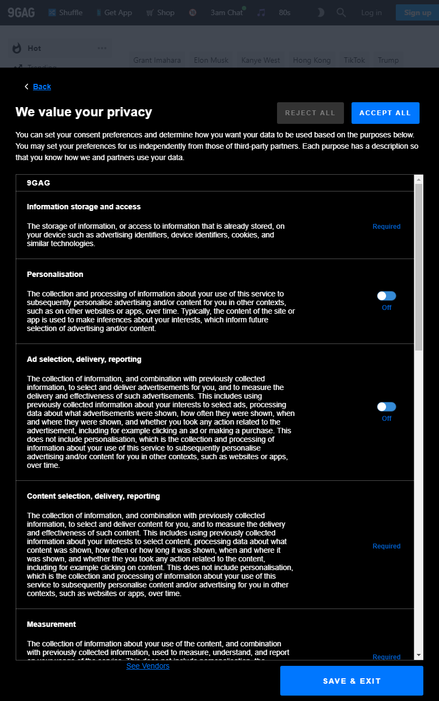

### The Problem

The great bane of GDPR, from a users perspective, is undeniably the barrage of cookie information and popups when visiting a site. The infinite variations of displaying the same information; from official legal disclaimers that just want you to click that big green "I agree" button, to the self aware, simplistic pop up bars. They all achieve relatively the same purpose. And the large majority of us can openly admit we just click that "I agree" button as fast as possible to get it out of our faces.

In some cases this isn't a poor UX choice, it's by design. The sites want you to blindly agree to the sharing of your information with 100 other vendors. If you take your time and read through all the legal jargon they throw your way, you may find the sites are doing a lot with your information and they don't always make it easy for you to control what is done with this data collected about you. Take [9Gag](https://9gag.com/) for example, where you are presented with an overly large amount of information that, upon reading, you realise that your information is shared with hundreds of 3rd party vendors. Until recently you couldn't just turn that off, you had to individually reject each vendor by clicking an option for each one. In fact I had to write a line of JavaScript to save me clicking through each one:

```
document.querySelectorAll('input[type="checkbox"]').forEach(i => i.click())
```



Not only are they an eye sore and a disruption to the user experience, they don't always act as intended. Your cookie choices are meant to be stored and remembered yet many sites slap you round the face with the same popup messages and agreements every time you visit the site. Since the introduction of the laws requiring the cookie notices and control, a considerable shift became apparent to the user experience for the web as a whole. But it doesn't need to be this way.

### The Solution

It seems futile to complain about something that, at the end of the day, is a legal requirement. These websites are required to notify you of the data they are collecting about you, what they are doing with it and what they are storing on your device. But I feel there is a potential approach that doesn't condemn the user to a bombardment of popups and notifications on every site that they visit.

The idea stems from the project that Sir Tim Berners Lee is working on called [Solid](https://solid.mit.edu/) where users have control over their personal data and who can access it and what they can do with it. This idea can be expanded upon to create a cookie data management service.

This can be a subscription based system where sites subscribe to it and any users that connect to the sites that have a profile within the system can seamlessly give their automatic consent through the system without having any popups. This will be achieved by having the users pre-define what data of theirs is allowed to be used, by whom and for what purposes. The management system in the middle can be given permission to grant cookie permissions on the users behalf if they align with the users pre-defined rule sets. If they don't align then it can be down to the user to reject all cookies automatically or allow the popups in those cases.

If properly implemented with a large uptake in compatible sites, this could create a step in the right direction for removing this clutter and disruption from the overall web user experience.
