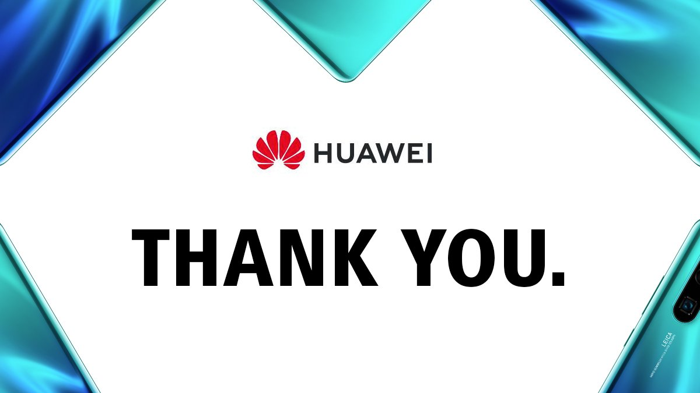

TLDR; Make security easier, not frustrating

### Why use Biometrics?
In my opinion, the best use of security technology is biometrics (ie. your human characteristics). It lets you prove to your bank -- or other online apps -- who you are without the fuss of typing a long password that you probably reuse for every single site you’ve registered to.

Biometrics also provide an extra factor of authentication, as, unlike a password, nobody else has your biometrics (unless, of-course, they chop off your finger or eyes) 😬 -- this is known as *inherence*, or *something you are*. This is so relevant that if you follow the Payments space, biometrics will be [one of the preferred ways to confirm online payments with your bank starting in 2021](https://www.biometricupdate.com/201910/how-behavioral-biometrics-can-ensure-compliance-with-psd2-and-any-regulation-that-impacts-customer-data-protection) enforced by the European Banking Authority (EBA). That will make online fraud much harder.

### Why the rant, bro?

For that I bring you the [Huawei P20](https://www.amazon.co.uk/Huawei-5-8-Inch-FullView-Smartphone-Headphones-Black/dp/B07C7FDWP8) smartphone. 

Besides the obvious national security concerns of the Chinese government spying on your hopefully innocent traffic, this phone has a much more subtle user experience problem: the fingerprint sensor. 🇨🇳 ☝️

And when I say the fingerprint sensor, I mean the home-page button at the bottom. The distinction between both really depends on how hard you press the button, which in my experience is *impossible* to measure as a human.

Imagine this.

_You’ve had a nice dinner with your friends and it’s time to split the bill, via Monzo, of course.
As you type in the amount to transfer your friend, the app pops up with the fingerprint authentication, which you gladly follow-up by inserting your finger very-very slowly on the fingerprint sensor.
But it turns out very-very slowly this time was a bit too hard, so Huawei decided to kick you out of the app and take you back to the home-page._

Was the fingerprint captured ok? Did money come out of my account? Did the app just crash? This could easily prompt you to try again and accidentally transfer more money out of your account. 💸
"Money with wings emoji" is the accurate representation of the problem here.

Huawei brought a really neat idea and managed to save space by packing the fingerprint with a button, but it simply didn't get it right. Maybe the solution is better tweaking of the software, or simply accepting that these two functionalities shouldn't share the same space. Either way, not amazing user experience. 

**Moral of the story**: make biometrics authentication easy and seamless, after-all, people’s savings are on the line.
